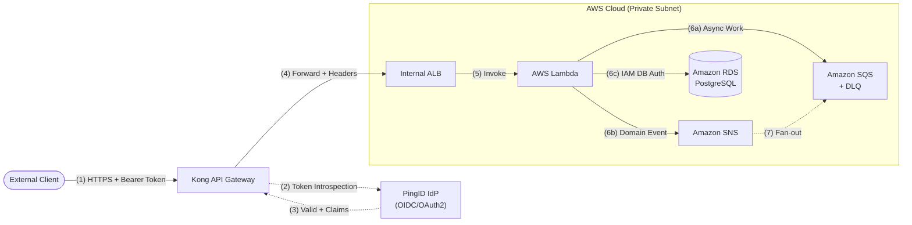

# Enterprise Integration Pattern Standard

> **Version:** 1.0 | **Status:** Approved | **Last Updated:** 2026-02-08
> **Applies to:** All services integrating through the enterprise cloud-native stack.

---

## 1. Introduction

### 1.1 Purpose

This document defines the **mandatory integration architecture** for all enterprise services built on the following technology stack:

| Layer            | Technology                        |
| ---------------- | --------------------------------- |
| Cloud Platform   | AWS (Lambda, SQS, SNS, RDS)      |
| API Gateway      | Kong API Gateway                  |
| Identity Provider| PingID (OIDC / OAuth 2.0)        |

Every inbound API request, service-to-service call, and event-driven flow **must** conform to the patterns described here. The goal is to ensure **consistent security enforcement, traffic governance, and operational observability** across all integration points.

### 1.2 Scope

- Inbound request flows (external clients → backend services)
- AuthN/AuthZ enforcement at the gateway tier
- AWS service connectivity from Kong
- Asynchronous event flows within the AWS environment
- Naming, tagging, and operational conventions

### 1.3 Guiding Principles

| Principle              | Rationale                                                        |
| ---------------------- | ---------------------------------------------------------------- |
| Zero-trust by default  | Every request is authenticated and authorized at the edge        |
| Gateway-first routing  | No backend is directly internet-exposed; Kong is the single entry|
| Least-privilege IAM    | Kong-to-AWS uses scoped IAM roles, never long-lived keys         |
| Async where possible   | Heavy/fan-out work uses SQS/SNS, not synchronous chains          |
| Observable everything  | Correlation IDs propagate end-to-end; metrics at every hop       |

---

## 2. Standard Architecture Pattern — Secure Inbound Request Flow

### 2.1 Canonical Flow

```
External Client
      │
      │  (1) HTTPS request + Bearer token (or initiates OIDC login)
      ▼
┌─────────────────────┐
│  Kong API Gateway    │──(2) Token Introspection / JWKS validation ──▶ PingID IdP
│  (Public Subnet)     │◀── (3) Token valid + claims ─────────────────┘
│                     │
│  (4) Apply rate-limit, request-transform, correlation-id plugins
│                     │
│  (5) Forward request│   (mTLS or VPC Link)
└────────┬────────────┘
         │
         ▼
┌──────────────────────────────────────────────┐
│          AWS Cloud Environment               │
│          (Private Subnet)                    │
│                                              │
│  ┌──────────────┐    ┌──────────────┐        │
│  │ API Gateway / │───▶│ AWS Lambda   │        │
│  │ ALB (internal)│    │ (or ECS/EKS) │        │
│  └──────────────┘    └──────┬───────┘        │
│                             │                │
│           ┌─────────────────┼───────────┐    │
│           ▼                 ▼           ▼    │
│     ┌──────────┐     ┌──────────┐ ┌────────┐│
│     │  Amazon   │     │  Amazon  │ │ Amazon ││
│     │   SQS     │     │   SNS    │ │  RDS   ││
│     └──────────┘     └──────────┘ └────────┘│
└──────────────────────────────────────────────┘
```

### 2.2 Step-by-Step Description

| Step | From → To                           | Protocol / Mechanism              | Details                                                                                                                                                |
| ---- | ----------------------------------- | --------------------------------- | ------------------------------------------------------------------------------------------------------------------------------------------------------ |
| 1    | Client → Kong                       | HTTPS (TLS 1.2+)                  | Client sends request with `Authorization: Bearer <access_token>` header. Token obtained via OIDC Authorization Code flow or Client Credentials grant.  |
| 2    | Kong → PingID                       | HTTPS (Token Introspection / JWKS)| Kong's **OpenID Connect plugin** validates the JWT. Can use local JWKS validation (preferred for latency) or real-time introspection for opaque tokens. |
| 3    | PingID → Kong                       | JSON response                     | Returns token validity, scopes, claims (`sub`, `aud`, `roles`, custom claims).                                                                         |
| 4    | Kong (internal)                     | Plugin chain                      | Applies rate-limiting, IP restriction, request-transformer (inject headers), correlation-id, and logging plugins sequentially.                          |
| 5    | Kong → AWS backend                  | HTTPS via VPC Link / AWS VPN      | Request forwarded with injected headers: `X-Consumer-ID`, `X-Correlation-ID`, `X-Authenticated-Scope`. Backend never re-authenticates.                 |
| 6    | Lambda/ECS → SQS/SNS/RDS           | AWS SDK (IAM role)                | Backend performs business logic; heavy or fan-out work is dispatched to SQS/SNS. State persists to RDS.                                                |

---

## 3. Authentication & Authorization Specifications

### 3.1 PingID OIDC Configuration

**Discovery endpoint:** `https://auth.enterprise.com/.well-known/openid-configuration`

| Parameter             | Value / Requirement                             |
| --------------------- | ----------------------------------------------- |
| Grant Types           | `authorization_code` (user), `client_credentials` (service) |
| Token Format          | Signed JWT (RS256)                              |
| Token Lifetime        | Access: 15 min, Refresh: 8 hrs                  |
| Required Claims       | `sub`, `aud`, `iss`, `exp`, `scope`, `roles`    |
| Custom Claims         | `department`, `cost_center` (for ABAC policies) |
| PKCE                  | **Required** for all public clients             |

### 3.2 Kong JWT Validation (OpenID Connect Plugin)

```yaml
# Kong OIDC Plugin — declarative config (kong.yml)
plugins:
  - name: openid-connect
    config:
      issuer: "https://auth.enterprise.com/"
      client_id: ["kong-gateway-client"]
      auth_methods: ["bearer"]
      scopes_required: ["api.read"]       # route-level override
      token_post_logout_redirect_uri: null
      cache_ttl: 300                       # JWKS cache in seconds
      verify_signature: true
      verify_claims: true
      consumer_claim: ["sub"]
      credential_claim: ["sub"]
```

**Validation sequence inside Kong:**

1. Extract `Authorization: Bearer <token>` header
2. Decode JWT header → fetch signing key from PingID JWKS endpoint (cached)
3. Verify signature (RS256), `exp`, `iss`, `aud`
4. Extract `scope` claim → match against route-level `scopes_required`
5. If valid → set upstream headers; if invalid → return `401` / `403`

### 3.3 Scope-to-Route Mapping Convention

| Route Pattern           | Required Scope          | HTTP Methods     |
| ----------------------- | ----------------------- | ---------------- |
| `/api/v1/orders`        | `orders.read`           | GET              |
| `/api/v1/orders`        | `orders.write`          | POST, PUT, PATCH |
| `/api/v1/orders`        | `orders.admin`          | DELETE           |
| `/api/v1/payments/**`   | `payments.process`      | POST             |
| `/internal/health`      | *(none — exempted)*     | GET              |

### 3.4 Service-to-Service (M2M) Authentication

For backend services calling each other **through Kong**:

1. Caller obtains token via **Client Credentials** grant from PingID
2. Token includes `scope: service.<caller-name>.invoke`
3. Kong validates token identically — no special bypass

For backend services calling each other **within the VPC** (not through Kong):

- Use **AWS IAM roles** with STS `AssumeRole`
- Never embed credentials; use execution-role-based identity

---

## 4. AWS Integration Specifications

### 4.1 Kong → AWS Connectivity

| Method              | When to Use                                 | Configuration                                                         |
| ------------------- | ------------------------------------------- | --------------------------------------------------------------------- |
| **VPC Link**        | Kong deployed in/peered with AWS VPC        | Kong upstream targets internal ALB/NLB DNS. No public exposure.       |
| **AWS Lambda Plugin**| Serverless backends                        | Kong `aws-lambda` plugin with IAM role (cross-account if needed).     |
| **mTLS**            | High-security / compliance workloads        | Mutual TLS between Kong and internal ALB. Certs via ACM PCA.          |

### 4.2 Kong AWS-Lambda Plugin Configuration

```yaml
plugins:
  - name: aws-lambda
    config:
      aws_region: "us-east-1"
      function_name: "order-processing-fn"
      invocation_type: "RequestResponse"    # synchronous
      aws_imds_protocol_version: "v2"       # IMDSv2 required
      # IAM: Kong's EC2/ECS task role must have lambda:InvokeFunction
      # No aws_key / aws_secret — use execution role only
```

**IAM Policy (least-privilege) for Kong's execution role:**

```json
{
  "Version": "2012-10-17",
  "Statement": [
    {
      "Effect": "Allow",
      "Action": "lambda:InvokeFunction",
      "Resource": "arn:aws:lambda:us-east-1:123456789012:function:order-*"
    }
  ]
}
```

### 4.3 AWS Backend Architecture

| Component       | Role                                          | Configuration Notes                                       |
| --------------- | --------------------------------------------- | --------------------------------------------------------- |
| **AWS Lambda**  | Stateless request handler                     | 256–1024 MB memory; 30s timeout; VPC-attached for RDS     |
| **Amazon SQS**  | Async work queue (decoupling, retry)          | Visibility timeout = 6× Lambda timeout; DLQ after 3 retries |
| **Amazon SNS**  | Fan-out notifications                         | Publish domain events; SQS subscriptions per consumer     |
| **Amazon RDS**  | Relational persistence (PostgreSQL/MySQL)     | Multi-AZ; IAM DB auth; private subnet only                |

### 4.4 Lambda → SQS/SNS/RDS Patterns

```
                   ┌──── SNS (fan-out) ────▶ SQS-A (service A)
Lambda ───────────┤                        ▶ SQS-B (service B)
  │               └──── SQS (point-to-point) ──▶ Worker Lambda
  │
  └──── RDS (read/write via IAM DB auth) ──▶ PostgreSQL
```

**Mandatory rules:**
- Lambda publishes to SNS/SQS using the **AWS SDK v3** with the execution role
- Never hardcode credentials — use `AWS_LAMBDA_EXEC_WRAPPER` or default credential chain
- SQS consumers use **batch processing** (`BatchSize: 10`, `MaxBatchingWindow: 5s`)
- Every SQS queue has a Dead Letter Queue with `maxReceiveCount: 3`
- RDS connections via **RDS Proxy** to manage Lambda connection pooling

---

## 5. Cross-Cutting Concerns

### 5.1 Correlation & Tracing

| Hop                  | Header / Attribute              | Generator       |
| -------------------- | ------------------------------- | --------------- |
| Client → Kong        | `X-Request-ID` (optional)       | Client          |
| Kong → Backend       | `X-Correlation-ID`              | Kong plugin     |
| Lambda → SQS/SNS     | `MessageAttribute: correlationId` | Lambda code   |
| SQS → Worker Lambda  | Extract from `MessageAttributes`| Worker code     |

### 5.2 Rate Limiting & Throttling

```yaml
# Kong Rate-Limiting Plugin (per-consumer)
plugins:
  - name: rate-limiting-advanced
    config:
      limit: [100]
      window_size: [60]       # 100 requests per 60 seconds
      identifier: "consumer"
      strategy: "redis"        # shared state across Kong nodes
      sync_rate: 10
```

### 5.3 Error Response Standard

All error responses from Kong (and backend services) follow **RFC 7807 Problem Details**:

```json
{
  "type": "https://errors.enterprise.com/auth/insufficient-scope",
  "title": "Forbidden",
  "status": 403,
  "detail": "Token does not contain required scope: orders.write",
  "instance": "/api/v1/orders",
  "correlationId": "abc-123-def-456"
}
```

---

## 6. Naming & Tagging Conventions

### 6.1 Kong Routes & Services

```
Service:  svc-<domain>-<version>         →  svc-orders-v1
Route:    rt-<domain>-<action>-<version> →  rt-orders-list-v1
Plugin:   Inherited from service or applied at route level
```

### 6.2 AWS Resources

```
Lambda:   <team>-<domain>-<action>-fn     →  payments-order-process-fn
SQS:      <team>-<domain>-<action>-queue  →  payments-order-process-queue
SQS DLQ:  <team>-<domain>-<action>-dlq    →  payments-order-process-dlq
SNS:      <team>-<domain>-<event>-topic   →  payments-order-created-topic
RDS:      <team>-<domain>-db              →  payments-orders-db
```

### 6.3 Mandatory AWS Tags

| Tag Key           | Example Value       | Purpose              |
| ----------------- | ------------------- | -------------------- |
| `team`            | `payments`          | Ownership            |
| `environment`     | `prod` / `staging`  | Lifecycle            |
| `cost-center`     | `CC-4200`           | FinOps               |
| `data-classification` | `confidential` | Compliance           |

---

## 7. Draw.io Diagram Definition

Use this section to assemble or verify the canonical integration diagram.

### 7.1 Components (Draw.io Shapes)

| # | Component Name                | Shape / Style                          | Position (approx.) |
|---|-------------------------------|----------------------------------------|---------------------|
| 1 | **External Client**           | Actor (stick figure) or rounded rect, light-blue fill | Far left            |
| 2 | **Kong API Gateway**          | Rounded rectangle, green fill, label "Kong API Gateway" | Center-left         |
| 3 | **PingID Identity Provider**  | Rounded rectangle, orange fill, label "PingID IdP (OIDC)" | Top-center (above Kong) |
| 4 | **AWS Cloud Environment**     | Large dashed-border rectangle, label "AWS Cloud (Private Subnet)" | Right half of canvas |
| 5 | **Internal ALB / API GW**     | Small rectangle inside AWS box, label "Internal ALB" | Inside AWS, left edge |
| 6 | **AWS Lambda**                | Lambda icon (or hexagon), label "Lambda Function" | Inside AWS, center  |
| 7 | **Amazon SQS**                | Queue icon, label "SQS Queue + DLQ"   | Inside AWS, bottom-left |
| 8 | **Amazon SNS**                | Bell/notification icon, label "SNS Topic" | Inside AWS, bottom-center |
| 9 | **Amazon RDS**                | Cylinder (database), label "RDS PostgreSQL" | Inside AWS, bottom-right |

### 7.2 Arrows & Data Flows

| # | From                     | To                       | Arrow Style           | Label on Arrow                                                   |
|---|--------------------------|--------------------------|------------------------|------------------------------------------------------------------|
| A | External Client          | Kong API Gateway         | Solid, black, →        | `(1) HTTPS + Bearer Token`                                       |
| B | Kong API Gateway         | PingID IdP               | Dashed, orange, →      | `(2) Token Introspection / JWKS Fetch`                           |
| C | PingID IdP               | Kong API Gateway         | Dashed, green, ←       | `(3) Token Valid + Claims (sub, scope, roles)`                   |
| D | Kong API Gateway         | Internal ALB (AWS)       | Solid, blue, →         | `(4) Forwarded Request (X-Correlation-ID, X-Consumer-ID)`        |
| E | Internal ALB             | AWS Lambda               | Solid, blue, →         | `(5) Invoke`                                                     |
| F | AWS Lambda               | Amazon SQS               | Solid, gray, →         | `(6a) Enqueue Async Work`                                        |
| G | AWS Lambda               | Amazon SNS               | Solid, gray, →         | `(6b) Publish Domain Event`                                      |
| H | AWS Lambda               | Amazon RDS               | Solid, gray, →         | `(6c) Read/Write (IAM DB Auth)`                                  |
| I | Amazon SNS               | Amazon SQS               | Dashed, gray, →        | `(7) Fan-out Subscription`                                       |

### 7.3 Assembly Instructions

1. **Canvas:** Set page to Landscape, A3 or custom 1400×800px.
2. **Left zone:** Place **External Client** at `(50, 350)`.
3. **Center zone:** Place **Kong API Gateway** at `(300, 350)`. Place **PingID IdP** at `(300, 100)` — directly above Kong.
4. **Right zone:** Draw a large **dashed rectangle** from `(600, 50)` to `(1350, 700)` labeled "AWS Cloud Environment (Private Subnet)".
5. Inside the AWS box, place **Internal ALB** at `(650, 350)`, **Lambda** at `(900, 350)`, **SQS** at `(750, 580)`, **SNS** at `(950, 580)`, **RDS** at `(1150, 580)`.
6. Draw arrows A–I per the table above. Use **waypoints** to avoid crossing.
7. Add a **legend box** at bottom-left: Solid = synchronous, Dashed = async/validation, Colors = see arrow table.
8. Add a **title block** top-center: "Enterprise Integration Pattern — Kong + PingID + AWS".

### 7.4 Mermaid Equivalent (for quick rendering)



---

## 8. Security Checklist

- [ ] All external traffic terminates TLS at Kong (TLS 1.2+ only)
- [ ] PingID JWKS endpoint cached with TTL ≤ 300s
- [ ] No AWS access keys in Kong config — IAM roles only
- [ ] Kong admin API is **not** internet-exposed
- [ ] SQS queues encrypted at rest (SSE-SQS or SSE-KMS)
- [ ] RDS encrypted at rest and in transit; IAM DB authentication enabled
- [ ] Lambda functions run inside VPC private subnets with NAT Gateway for outbound
- [ ] All resources tagged per Section 6.3

---

## 9. Operational Runbook Reference

| Scenario                            | Action                                                        |
| ----------------------------------- | ------------------------------------------------------------- |
| Token validation failures spike     | Check PingID JWKS endpoint health; verify Kong OIDC plugin cache TTL |
| Lambda throttling                   | Increase reserved concurrency; check SQS `ApproximateAgeOfOldestMessage` |
| SQS DLQ accumulating messages       | Inspect DLQ; fix consumer bug; redrive messages               |
| Kong 502 errors                     | Verify upstream ALB health checks; check VPC Link / security groups |
| RDS connection exhaustion           | Confirm RDS Proxy is active; tune Lambda `max_connections`    |

---

*End of Integration Pattern Standard*
